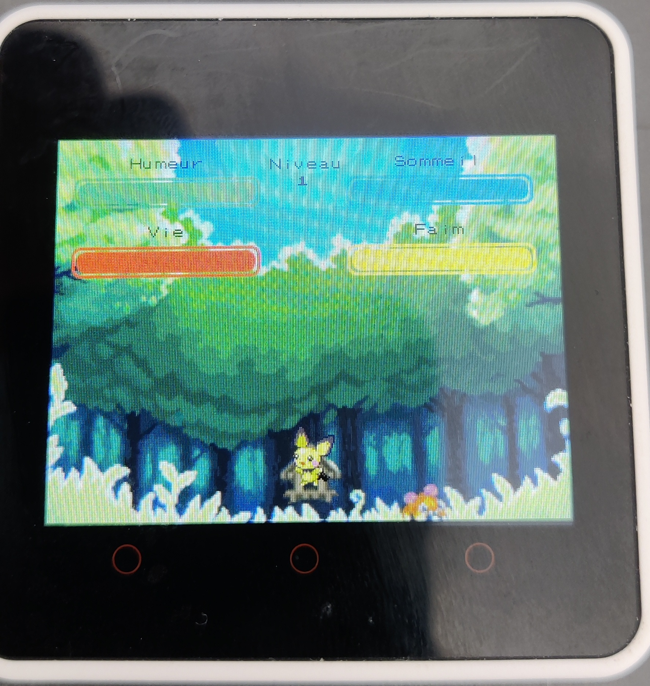
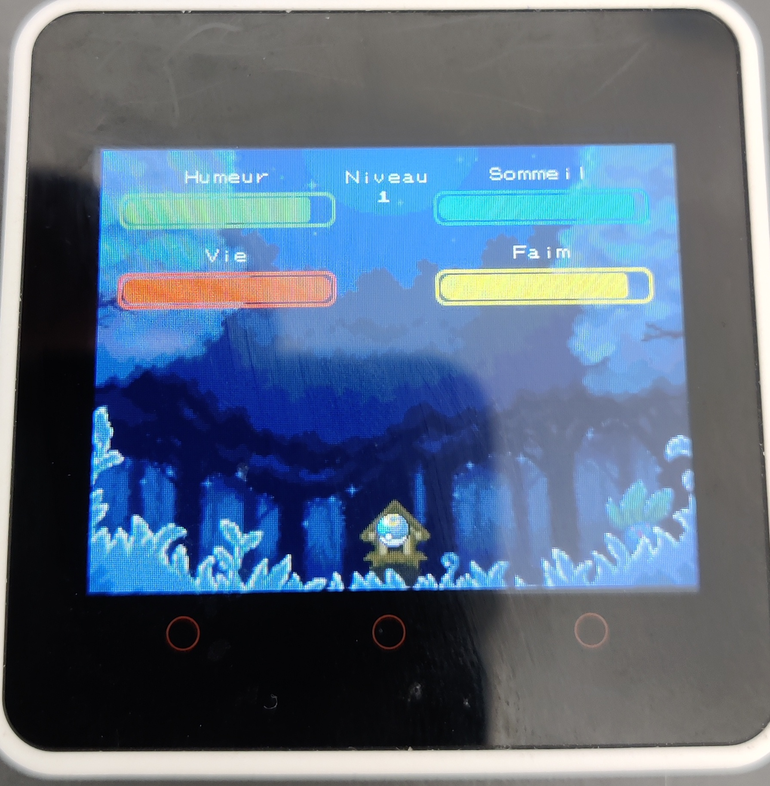
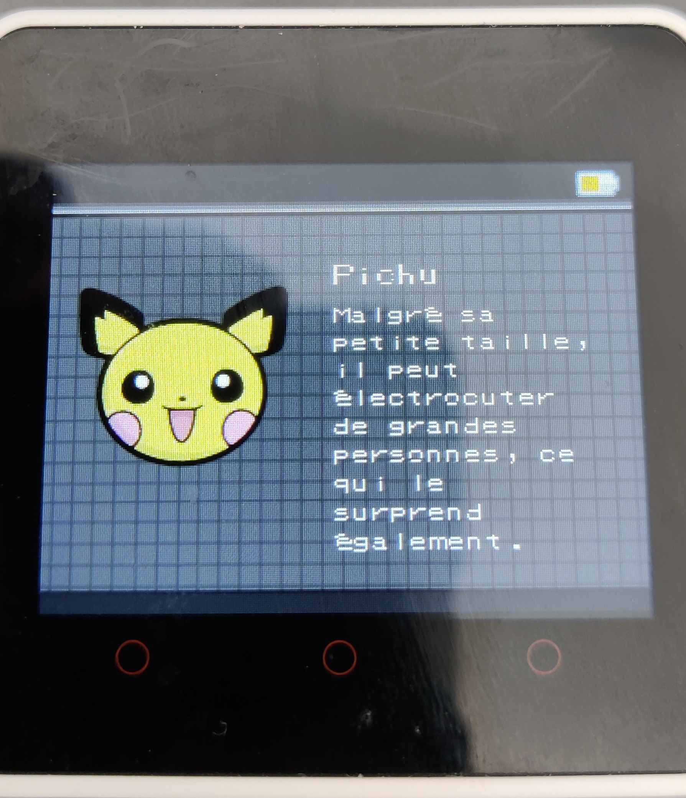
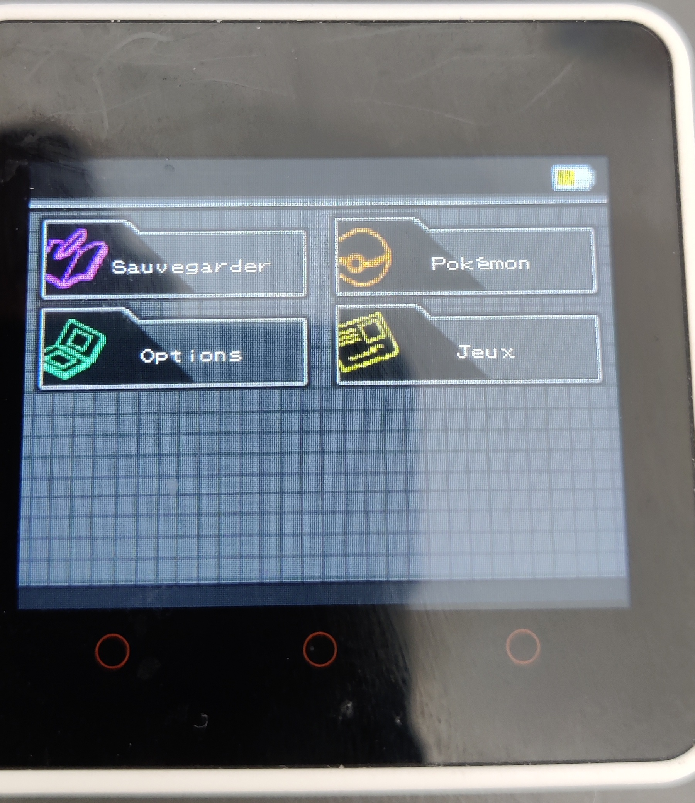

# PokeGotchi

Trying to provide a tamagotchi game for my daugther, based on little characters she likes.

Everything is working for the M5Core2 and SDL in C/C++, Thanks to [lvgl v9](https://github.com/lvgl/lvgl)

## Installation

### Requirements for M5Core2

You need to copy the `mklittlefs` tool at the root of the project directory.
It's available here: https://github.com/earlephilhower/mklittlefs/releases

Then you will be able to upload files into the `LittleFs` partition (SPIFFS).

```
$ pio run -t uploadfs
```

### Requirements for SDL

Install `SDL2` development package.

```
$ apt install libsdl2-dev
```

### Build translations

```shell

$ make install
$ make i18n-extract
$ make i18n-compile
```

Watch out, because of Arduino dependency, you can't simply commit the changed file.
You have to change `_p` into `_pl` and make sure struct are correctly defined.

## Dependencies

 - [Arduino](https://github.com/arduino/Arduino)
 - [Pokemon font](https://github.com/PascalPixel/pokemon-font)
 - [lvgl 8](https://github.com/lvgl/lvgl)
 - [M5Core2](https://github.com/m5stack/M5Core2)
 - [PlatformIO](https://platformio.org/)


## Usage

Features:

- Save/Load game (M5Core2 only)
- Start with Eevee or Pikachu
- Choose pokeball
- Brightness (M5Core2 only)
- Two additionals games inside (M5Core2 only)
- Pokemon description

Actions:

- Clean (poos and pees)
- Eat
- Train (Evolve)
- Play
- Sleep

## Screenshots





